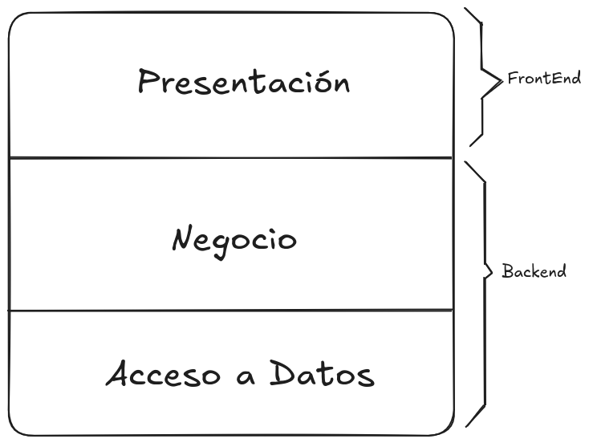
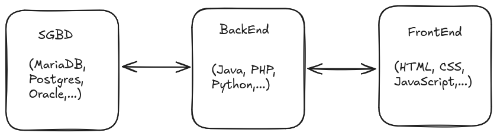

# Arquitectura de aplicaciones web

A la hora de desarrollar aplicaciones web, es importante comprender la arquitectura subyacente que permite su funcionamiento. La arquitectura de aplicaciones web se refiere a la estructura y organización de los componentes que conforman una aplicación web, así como a la forma en que estos componentes interactúan entre sí y con los usuarios.

La arquitectura de aplicaciones web puede ser dividida en varias capas, cada una con su propio propósito y responsabilidad. 

<figure>
  
  <figcaption>Arquitectura de aplicaciones web</figcaption>
</figure>

En esta figura podemos ver una representación de la arquitectura de aplicaciones web, que incluye las siguientes capas:

* _Capa de presentación_: Esta capa es responsable de la interfaz de usuario y la interacción con el usuario. Incluye elementos como HTML, CSS y JavaScript, que permiten mostrar contenido y recibir entradas del usuario.
* _Capa de lógica de negocio_: Esta capa contiene la lógica y las reglas de negocio de la aplicación. Se encarga de procesar las solicitudes del usuario, realizar cálculos y tomar decisiones basadas en la información disponible.
* _Capa de acceso a datos_: Esta capa se encarga de almacenar y recuperar información de la aplicación. Puede incluir bases de datos, sistemas de archivos u otros servicios de almacenamiento. La capa de datos se comunica con la capa de lógica de negocio para proporcionar la información necesaria para procesar las solicitudes del usuario.

Es importante también hacer una división en dos partes. La parte que tiene interacción con el usuario, es considerado el Frontend, y la parte que no tiene interacción con el usuario, es considerado el Backend. Cada apartado tiene diferentes tecnologías y lenguajes de programación asociados, que permiten desarrollar aplicaciones web de manera eficiente y escalable.

* **Frontend**: Esta parte de la aplicación web se encarga de la presentación y la interacción con el usuario. Incluye tecnologías como HTML, CSS y JavaScript, así como frameworks y bibliotecas como React, Angular o Vue.js, que facilitan el desarrollo de interfaces de usuario dinámicas y responsivas.

* **Backend**: Esta parte de la aplicación web se encarga de la lógica de negocio y el acceso a datos. Incluye lenguajes de programación como Python, Java, PHP, Node.js, entre otros, y frameworks que permiten construir servicios web robustos y escalables.

## Arquitectura de aplicaciones web y su relación con la evolución de la web

La evolución de la web ha llevado a cambios significativos en la forma en que se diseñan y desarrollan las aplicaciones web. Desde las primeras páginas estáticas hasta las aplicaciones web modernas, la arquitectura ha ido evolucionando para adaptarse a las necesidades cambiantes de los usuarios y los desarrolladores.

Vamos a hablar de la evolución de la web y cómo ha influido en la arquitectura de las aplicaciones web, desde la Web 1.0 hasta la Web 3.0.

* _Aplicaciones CGI_: En la Web 1.0, las aplicaciones web eran principalmente estáticas y unidireccionales. Los usuarios podían acceder a información, pero la interacción era mínima. La arquitectura de estas aplicaciones se centraba en la presentación de contenido y no requería procesamiento del lado del servidor.
* _Aplicaciones web dinámicas_: Gracias a la utilización de lenguajes de programación del lado del servidor, como PHP, Python y Ruby, así como a la adopción de tecnologías como AJAX, las aplicaciones web comenzaron a ser más dinámicas y permitieron a los usuarios crear contenido, interactuar con otros usuarios y personalizar su experiencia en línea.
* _Aplicaciones web PDA_: Hoy en día, con las diferentes tecnologías que podemos encontrar, se pueden crear aplicaciones web progresivas (PWA) que combinan lo mejor de las aplicaciones web y las aplicaciones móviles, ofreciendo funcionalidades como notificaciones push, acceso sin conexión y rendimiento optimizado. Además, la Web 3.0 busca mejorar la experiencia del usuario mediante el uso de inteligencia artificial y aprendizaje automático para ofrecer contenido más relevante y personalizado.

## Tipos de arquitecturas de aplicaciones web

Una vez hemos visto la arquitectura más común de las aplicaciones web, es importante conocer los diferentes tipos de arquitecturas que se pueden utilizar para desarrollar aplicaciones web. Cada tipo de arquitectura tiene sus propias ventajas y desventajas, y la elección de una u otra dependerá de los requisitos específicos del proyecto.

Veamos algunos de los tipos de arquitecturas más comunes:

* **Arquitectura monolítica**: En esta arquitectura, todos los componentes de la aplicación web se encuentran integrados en un único bloque de código. Esto puede facilitar el desarrollo inicial, pero puede dificultar la escalabilidad y el mantenimiento a medida que la aplicación crece.
* **Arquitectura de microservicios**: En esta arquitectura, la aplicación web se divide en múltiples servicios independientes, cada uno con su propia lógica de negocio y base de datos. Esto permite una mayor escalabilidad y flexibilidad, ya que cada servicio puede ser desarrollado, desplegado y escalado de manera independiente.
* **Arquitectura basada en servicios (SOA)**: En esta arquitectura, la aplicación web se organiza en torno a servicios que se comunican entre sí a través de interfaces bien definidas. Esto permite una mayor modularidad y reutilización de componentes, así como una mejor integración con otros sistemas.
* **Arquitectura de cliente-servidor**: En esta arquitectura, la aplicación web se divide en dos partes: el cliente, que se ejecuta en el navegador del usuario, y el servidor, que procesa las solicitudes y proporciona los datos necesarios. Esta arquitectura es ampliamente utilizada en aplicaciones web modernas y permite una separación clara entre la presentación y la lógica de negocio.

!!! info
    La arquitectura de microservicios es una de las más utilizadas hoy en día. Su auge se debe a que permite una mayor escalabilidad y flexibilidad en el desarrollo de aplicaciones web, así como una mejor integración con otros sistemas y servicios. Una de las empreass que más apostó por esta arquitectura es Netflix, que la utiliza para ofrecer su servicio de streaming de manera eficiente y escalable. Puedes encontrar más información sobre la arquitectura de microservicios en [Microservices.io](https://microservices.io/).

 ## Arquitectura de aplicaciones web y su relación con el despliegue de aplicaciones web

 En muchas ocasiones, la arquitectura de aplicaciones web está estrechamente relacionada con el despliegue de aplicaciones web. La forma en que se organiza y estructura la aplicación puede influir en cómo se despliega y se gestiona en un entorno de producción.

 Normalmente, una aplicación web se compone de varios componentes que deben ser desplegados y configurados correctamente para garantizar un funcionamiento óptimo. Esto puede incluir servidores web, bases de datos, servicios de almacenamiento y otros componentes necesarios para el correcto funcionamiento de la aplicación.

 Veamos un esquema:

 <figure>
   
   <figcaption>Arquitectura de aplicaciones web y su relación con el despliegue de aplicaciones web</figcaption>
</figure>

En este esquema podemos ver los siguientes componentes:

* **Servidor web**: Es el componente encargado de recibir las solicitudes de los usuarios y enviar las respuestas correspondientes. Puede ser un servidor HTTP como Apache o Nginx, que se encarga de servir los archivos estáticos y gestionar las solicitudes dinámicas. Normalmente se encarga del llamado Frontend, que es la parte de la aplicación web que interactúa con el usuario.
* **Servidor de aplicaciones**: Es el componente encargado de ejecutar la lógica de negocio de la aplicación web. Puede ser un servidor de aplicaciones como Tomcat, JBoss o Node.js, que se encarga de procesar las solicitudes dinámicas y generar las respuestas correspondientes. Normalmente se encarga del llamado Backend, que es la parte de la aplicación web que no interactúa con el usuario. Suele usar un lenguaje de programación del lado del servidor, como PHP, Python, Ruby o Node.js, y frameworks web que facilitan la creación de aplicaciones web interactivas.
* **Base de datos**: Es el componente encargado de almacenar y recuperar la información de la aplicación web. Puede ser un sistema de gestión de bases de datos como MySQL, PostgreSQL o MongoDB, que se encarga de gestionar los datos y proporcionar acceso a ellos a través de consultas y operaciones CRUD (crear, leer, actualizar y eliminar).